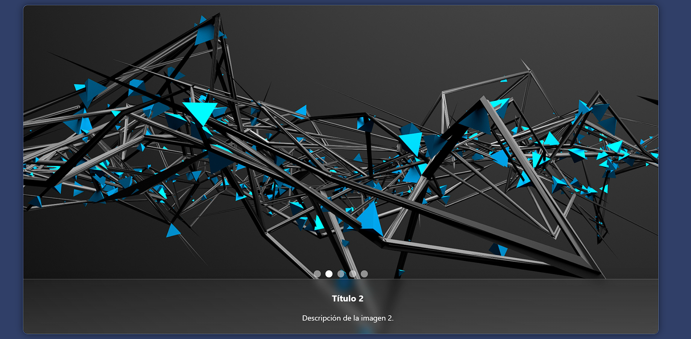
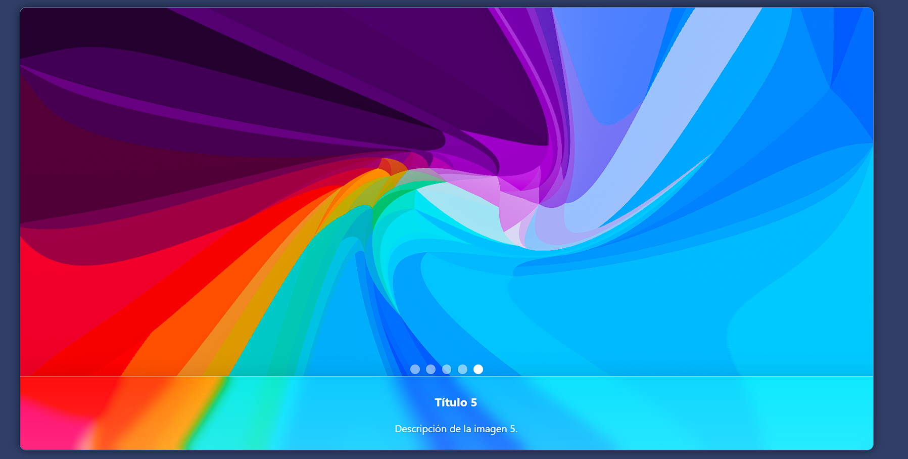

# CarruselInteractivoJS

**Librería JavaScript con Componente Visual Interactivo - Carrusel de Imágenes**

---

## Descripción

Este proyecto implementa un carrusel de imágenes 100% funcional, interactivo y personalizable, sin usar frameworks como React o Vue. Es ideal para integrarse en cualquier página web y mejora la presentación visual de contenido gráfico.

El carrusel incluye:
* Cambio automático de imágenes.  
* Indicadores para navegación manual.  
* Animaciones suaves y efecto de cristal en los estilos.  

---

## Instalación

Incluye los archivos en tu proyecto:

```html
<!-- Enlazar CSS -->
<link rel="stylesheet" href="css/estilo.css">

<!-- Estructura HTML -->
<div class="carrusel">
  <!-- Aquí van los items e indicadores -->
</div>

<!-- Enlazar JS -->
<script src="js/script.js"></script>
```

---

## Ejemplo de Uso Completo

### Estructura HTML:

```html
<div class="carrusel">

  <div class="carrusel-item activo">
    
    <div class="texto">
      <h3>Título 1</h3>
      <p>Descripción de la imagen 1.</p>
    </div>
  </div>

  <!-- Repetir bloques .carrusel-item para cada imagen -->

  <div class="indicadores">
    <span class="indicador activo" data-indice="0"></span>
    <span class="indicador" data-indice="1"></span>
    <!-- Más indicadores según la cantidad de imágenes -->
  </div>

</div>
```

Los estilos en `css/estilo.css` incluyen:  
- Fondo degradado y efecto vidrio.  
- Botones de navegación (opcional).  
- Indicadores de navegación.  

El comportamiento en `js/script.js` permite:
* Cambio automático cada 4 segundos.  
* Clic en indicadores para mostrar imagen específica.  
* Reinicio del temporizador al interactuar.

---

## ⚙️ Métodos y Funcionamiento

La librería incluye los siguientes métodos clave en el archivo:

📁 **js/script.js**

---

### 🔧 `mostrarImagen(i)`

Muestra la imagen en la posición `i` y actualiza los indicadores activos.

```js
const mostrarImagen = (i) => {
    items[indice].classList.remove('activo');
    indicadores[indice].classList.remove('activo');
    indice = i;
    items[indice].classList.add('activo');
    indicadores[indice].classList.add('activo');
};
```

---

### 🔄 `siguiente()`

Avanza automáticamente al siguiente item del carrusel:

```js
const siguiente = () => {
    let nuevoIndice = (indice + 1) % total;
    mostrarImagen(nuevoIndice);
};
```

---

### ⏲️ `reiniciarIntervalo()`

Reinicia el temporizador cuando el usuario interactúa, para evitar cambios bruscos durante la navegación manual:

```js
const reiniciarIntervalo = () => {
    clearInterval(intervalo);
    intervalo = setInterval(siguiente, tiempo);
};
```

---

## 🔘 Indicadores de Navegación Manual

Cada indicador tiene un atributo especial que permite la navegación al dar clic:

HTML de ejemplo:

```html
<div class="indicadores">
    <span class="indicador activo" data-indice="0"></span>
    <span class="indicador" data-indice="1"></span>
    <span class="indicador" data-indice="2"></span>
    <span class="indicador" data-indice="3"></span>
    <span class="indicador" data-indice="4"></span>
</div>
```

En el JS se lee ese atributo así:

```js
indicadores.forEach(indicador => {
    indicador.addEventListener('click', () => {
        let i = parseInt(indicador.getAttribute('data-indice'));
        mostrarImagen(i);
        reiniciarIntervalo();
    });
});
```

Esto permite que al hacer clic en un indicador, el carrusel muestre la imagen correspondiente y el temporizador se reinicie.

---


## 🛠 Estilos y Comportamiento Técnico

Los estilos se encuentran en:

📁 **css/estilo.css**

Incluyen:

✅ Fondo degradado y efecto de cristal (vidrio):

```css
.carrusel {
    position: relative;
    width: 1350px;
    height: 700px;
    overflow: hidden;
    border-radius: 10px;
    box-shadow: 0 0 15px rgba(0, 0, 0, 0.5);

    background: linear-gradient(to bottom right, rgba(255, 255, 255, 0.1), rgba(255, 255, 255, 0));
    backdrop-filter: blur(12px) saturate(180%);
    -webkit-backdrop-filter: blur(12px) saturate(180%);
    border: 1px solid rgba(255, 255, 255, 0.3);
}
```

✅ Botones de navegación (esto es opcional si se quiere optar por botones en los costados del carrusel):

```css
.btn-prev,
.btn-next {
    position: absolute;
    top: 50%;
    transform: translateY(-50%);
    background: linear-gradient(to bottom, rgba(255, 255, 255, 0.25), rgba(255, 255, 255, 0.05));
    backdrop-filter: blur(8px) saturate(180%);
    -webkit-backdrop-filter: blur(10px) saturate(180%);
    border: 1px solid rgba(255, 255, 255, 0.4);
    color: #fff;
    padding: 50px 15px;
    cursor: pointer;
    font-size: 20px;
    opacity: 0;
    transition: opacity 0.3s;
    border-radius: 12px;
    box-shadow: 0 4px 20px rgba(0, 0, 0, 0.2);
}
```

✅ Indicadores de navegación interactivos:

```css
.indicadores {
    position: absolute;
    bottom: 120px;
    width: 100%;
    display: flex;
    justify-content: center;
    gap: 10px;
    z-index: 10;
}

.indicador {
    width: 15px;
    height: 15px;
    background: rgba(255, 255, 255, 0.5);
    border-radius: 50%;
    cursor: pointer;
    transition: background 0.3s, transform 0.3s;
}
```

---

El comportamiento dinámico se encuentra en:

📁 **js/script.js**

Incluye:

✅ Cambio automático cada 4 segundos:

```js
const tiempo = 4000;
let intervalo = setInterval(siguiente, tiempo);
```

✅ Clic en indicadores para mostrar imagen específica:

```js
indicadores.forEach(indicador => {
    indicador.addEventListener('click', () => {
        let i = parseInt(indicador.getAttribute('data-indice'));
        mostrarImagen(i);
        reiniciarIntervalo();
    });
});
```

✅ Reinicio del temporizador al interactuar:

```js
const reiniciarIntervalo = () => {
    clearInterval(intervalo);
    intervalo = setInterval(siguiente, tiempo);
};
```

✅ Función principal para mostrar la imagen correspondiente y actualizar los indicadores:

```js
const mostrarImagen = (i) => {
    items[indice].classList.remove('activo');
    indicadores[indice].classList.remove('activo');
    indice = i;
    items[indice].classList.add('activo');
    indicadores[indice].classList.add('activo');
};
```

---

Puedes personalizar el estilo o modificar el comportamiento en los archivos mencionados según tus necesidades.


---

## Capturas de Pantalla

Asegúrate de subir las imágenes en la carpeta `/img` o `/capturas`. Ejemplo:

```markdown


```

---

## Video de Funcionamiento

Enlace al video demostrativo del componente:

 [Ver video en YouTube]([https://youtu.be/tu-link](https://youtu.be/tK-wLgJiGBU))

---

## Demostración en Línea - GitHub Pages

Puedes probar el carrusel directamente aquí:

 [Ver demostración en vivo](https://tu_usuario.github.io/CarruselInteractivoJS/)

---

