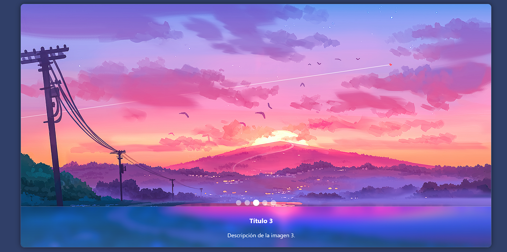
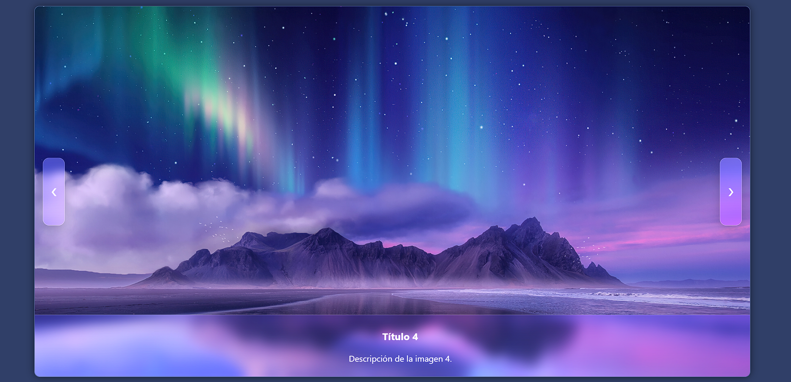

# CarruselInteractivoJS

**Librería JavaScript con Componente Visual Interactivo - Carrusel de Imágenes**

**Integrantes del equipo 5:**
- Fatima Martinez Lopez
- Alary Guzman Jimenez

---

## Descripción

Este proyecto implementa un carrusel de imágenes 100% funcional, interactivo y personalizable, sin usar frameworks como React o Vue. Es ideal para integrarse en cualquier página web y mejora la presentación visual de contenido gráfico.

El carrusel incluye:
* Cambio automático de imágenes.  
* Indicadores para navegación manual.  
* Animaciones suaves y efecto de cristal en los estilos.  

---

## Instalación

Incluye los archivos en tu proyecto:

```html
<!-- Enlazar CSS -->
<link rel="stylesheet" href="css/estilo.css">

<!-- Estructura HTML -->
<div class="carrusel">
  <!-- Aquí van los items e indicadores -->
</div>

<!-- Enlazar JS -->
<script src="js/script.js"></script>
```

---

## Ejemplo de Uso 

### Estructura HTML:

```html
<div class="carrusel">

  <div class="carrusel-item activo">
    
    <div class="texto">
      <h3>Título 1</h3>
      <p>Descripción de la imagen 1.</p>
    </div>
  </div>

  <!-- Repetir bloques .carrusel-item para cada imagen -->

  <div class="indicadores">
    <span class="indicador activo" data-indice="0"></span>
    <span class="indicador" data-indice="1"></span>
    <!-- Más indicadores según la cantidad de imágenes -->
  </div>

</div>
```

Los estilos en `css/estilo.css` incluyen:  
- Fondo degradado y efecto vidrio.  
- Botones de navegación (opcional).  
- Indicadores de navegación.  

El comportamiento en `js/script.js` permite:
* Cambio automático cada 4 segundos.  
* Clic en indicadores para mostrar imagen específica.  
* Reinicio del temporizador al interactuar.

---

## Métodos y Funcionamiento

Esta librería de carrusel tiene **2 versiones de interacción**:

* **Versión activa por defecto:** Navegación mediante los círculos indicadores (debajo de las imágenes).
* **Versión alternativa (comentada en el código):** Navegación mediante botones laterales con flechas.

---

## Versión con Círculos Indicadores (Activa por Defecto)

En esta versión, el usuario puede cambiar de imagen dando clic en los círculos que aparecen debajo del carrusel.

**HTML de los indicadores:**

```html
<div class="indicadores">
    <span class="indicador activo" data-indice="0"></span>
    <span class="indicador" data-indice="1"></span>
    <span class="indicador" data-indice="2"></span>
    <span class="indicador" data-indice="3"></span>
    <span class="indicador" data-indice="4"></span>
</div>
```

**JavaScript correspondiente:**

```js
let indice = 0;
const items = document.querySelectorAll('.carrusel-item');
const indicadores = document.querySelectorAll('.indicador');
const total = items.length;
const tiempo = 4000;

const mostrarImagen = (i) => {
    items[indice].classList.remove('activo');
    indicadores[indice].classList.remove('activo');
    indice = i;
    items[indice].classList.add('activo');
    indicadores[indice].classList.add('activo');
};

const siguiente = () => {
    let nuevoIndice = (indice + 1) % total;
    mostrarImagen(nuevoIndice);
};

let intervalo = setInterval(siguiente, tiempo);

const reiniciarIntervalo = () => {
    clearInterval(intervalo);
    intervalo = setInterval(siguiente, tiempo);
};

indicadores.forEach(indicador => {
    indicador.addEventListener('click', () => {
        let i = parseInt(indicador.getAttribute('data-indice'));
        mostrarImagen(i);
        reiniciarIntervalo();
    });
});
```

**Funcionamiento por Métodos:**

- `mostrarImagen(i)`  
  Muestra la imagen correspondiente al índice **i**. Actualiza las clases CSS para activar el item e indicador asociado. Elimina la clase activa del item e indicador previo.

- `siguiente()`  
  Calcula el siguiente índice de imagen de forma circular (al llegar al final, regresa al inicio). Llama a **mostrarImagen()** para cambiar de imagen automáticamente.

- `setInterval(siguiente, tiempo)`  
  Ejecuta la función **siguiente()** cada 4 segundos, generando el cambio automático de imágenes.

- `reiniciarIntervalo()`  
  Reinicia el intervalo de cambio automático. Se usa después de una interacción manual para evitar que el cambio automático se desincronice.

- `indicador.addEventListener('click', ...)`  
  Asocia un evento a cada círculo indicador. Al hacer clic, se obtiene su atributo **data-indice** y se muestra la imagen correspondiente. También se reinicia el intervalo automático.

---

## Versión Alternativa con Botones Laterales (Comentada)

Esta opción permite navegar usando botones de flechas, ubicados a los lados del carrusel. Actualmente está **comentada**, pero puedes activarla si lo deseas.

**HTML de los botones (comentados en el código):**

```html
<!-- <button class="btn-prev">&#10094;</button>
<button class="btn-next">&#10095;</button> -->
```

**JavaScript de los botones (también comentado):**

```js
// let indice = 0;
// const items = document.querySelectorAll('.carrusel-item');
// const total = items.length;
// const tiempo = 4000; 

// const siguiente = () => {
//     items[indice].classList.remove('activo');
//     indice = (indice + 1) % total;
//     items[indice].classList.add('activo');
// };

// const anterior = () => {
//     items[indice].classList.remove('activo');
//     indice = (indice - 1 + total) % total;
//     items[indice].classList.add('activo');
// };

// document.querySelector('.btn-next').addEventListener('click', () => {
//     siguiente();
//     reiniciarIntervalo();
// });

// document.querySelector('.btn-prev').addEventListener('click', () => {
//     anterior();
//     reiniciarIntervalo();
// });

// let intervalo = setInterval(siguiente, tiempo);

// const reiniciarIntervalo = () => {
//     clearInterval(intervalo);
//     intervalo = setInterval(siguiente, tiempo);
// };
```

**Funcionamiento por Métodos:**

- `siguiente()`  
  Avanza al siguiente item del carrusel. Si está en el último, regresa al primero. Gestiona las clases activas de los items.

- `anterior()`  
  Retrocede al item anterior del carrusel. Si está en el primero, salta al último. Actualiza las clases activas.

- `setInterval(siguiente, tiempo)`  
  Genera el cambio automático de imágenes cada 4 segundos ejecutando **siguiente()**.

- `reiniciarIntervalo()`  
  Detiene y reinicia el intervalo de cambio automático. Se llama tras una interacción manual para mantener el flujo sincronizado.

- `btn-next.addEventListener('click', ...)`  
  Al hacer clic en el botón de siguiente (**.btn-next**), se ejecuta **siguiente()** y se reinicia el intervalo automático.

- `btn-prev.addEventListener('click', ...)`  
  Al hacer clic en el botón de anterior (**.btn-prev**), se ejecuta **anterior()** y se reinicia el intervalo automático.

 **Nota:** Para activar esta versión, se debe hacer lo siguiente:
1. Quitar los comentarios **`<!-- -->`** en los botones del HTML.
2. Quitar los comentarios **`//`** en el bloque de JS correspondiente.
3. Comentar el codigo correspondiente a la version con círculos indicadores.
Se puede elegir entre ambas opciones de navegación, dependiendo de las necesidades. Por defecto está activa la de círculos para una experiencia más visual y moderna.

---


## Estilos y Comportamiento Técnico

Los estilos se encuentran en:

**css/estilo.css**

Incluyen:

Fondo degradado y efecto de cristal (vidrio):

```css
.carrusel {
    position: relative;
    width: 1350px;
    height: 700px;
    overflow: hidden;
    border-radius: 10px;
    box-shadow: 0 0 15px rgba(0, 0, 0, 0.5);

    background: linear-gradient(to bottom right, rgba(255, 255, 255, 0.1), rgba(255, 255, 255, 0));
    backdrop-filter: blur(12px) saturate(180%);
    -webkit-backdrop-filter: blur(12px) saturate(180%);
    border: 1px solid rgba(255, 255, 255, 0.3);
}
```
Texto sobre la imagen con efecto de cristal:

```css
.texto {
    position: absolute;
    bottom: 0;
    width: 100%;
    padding: 8px 15px;
    color: #fff;
    text-align: center;

    background: linear-gradient(to top, rgba(255, 255, 255, 0.15), rgba(255, 255, 255, 0.05));
    backdrop-filter: blur(10px) saturate(180%);
    -webkit-backdrop-filter: blur(15px) saturate(180%);

    border-top: 1px solid rgba(255, 255, 255, 0.3);
    box-shadow: 0 -4px 30px rgba(0, 0, 0, 0.1);
    border-radius: 0 0 10px 10px;
}
```

Botones de navegación (esto es opcional si se quiere optar por botones en los costados del carrusel):

```css
.btn-prev,
.btn-next {
    position: absolute;
    top: 50%;
    transform: translateY(-50%);
    background: linear-gradient(to bottom, rgba(255, 255, 255, 0.25), rgba(255, 255, 255, 0.05));
    backdrop-filter: blur(8px) saturate(180%);
    -webkit-backdrop-filter: blur(10px) saturate(180%);
    border: 1px solid rgba(255, 255, 255, 0.4);
    color: #fff;
    padding: 50px 15px;
    cursor: pointer;
    font-size: 20px;
    opacity: 0;
    transition: opacity 0.3s;
    border-radius: 12px;
    box-shadow: 0 4px 20px rgba(0, 0, 0, 0.2);
}
```

Indicadores de navegación interactivos:

```css
.indicadores {
    position: absolute;
    bottom: 120px;
    width: 100%;
    display: flex;
    justify-content: center;
    gap: 10px;
    z-index: 10;
}

.indicador {
    width: 15px;
    height: 15px;
    background: rgba(255, 255, 255, 0.5);
    border-radius: 50%;
    cursor: pointer;
    transition: background 0.3s, transform 0.3s;
}
```

---

El comportamiento dinámico se encuentra en:

 **js/script.js**

Incluye:

Cambio automático cada 4 segundos:

```js
const tiempo = 4000;
let intervalo = setInterval(siguiente, tiempo);
```

Clic en indicadores para mostrar imagen específica:

```js
indicadores.forEach(indicador => {
    indicador.addEventListener('click', () => {
        let i = parseInt(indicador.getAttribute('data-indice'));
        mostrarImagen(i);
        reiniciarIntervalo();
    });
});
```

Reinicio del temporizador al interactuar:

```js
const reiniciarIntervalo = () => {
    clearInterval(intervalo);
    intervalo = setInterval(siguiente, tiempo);
};
```

Función principal para mostrar la imagen correspondiente y actualizar los indicadores:

```js
const mostrarImagen = (i) => {
    items[indice].classList.remove('activo');
    indicadores[indice].classList.remove('activo');
    indice = i;
    items[indice].classList.add('activo');
    indicadores[indice].classList.add('activo');
};
```


---

## Capturas de Pantalla

**Carrusel en acción.**


**Círculo indicador** en accion (tercer círculo) al pasar el cursor sobre cualquiera de los círculos estos se haran un poco mas grandes.



**Version con botones de navegación.**




---

## Video de Funcionamiento

Enlace al video demostrativo del componente:

 [Ver video en YouTube](https://youtu.be/tK-wLgJiGBU)

---

## Demostración en Línea - GitHub Pages

Puedes probar el carrusel directamente aquí:

 [Ver demostración en vivo](https://alaryguzman.github.io/CarruselInteractivoJS/)

---

